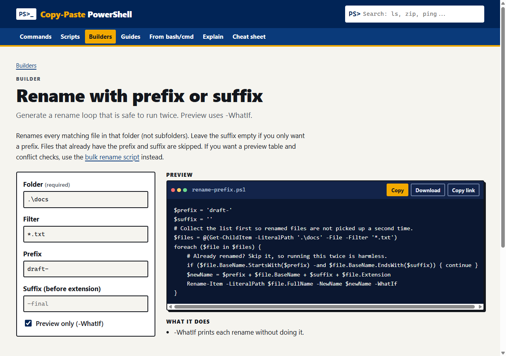

# Copy-Paste PowerShell

**Plain-English PowerShell you can copy, paste, and trust.**

[](https://github.com/TMHSDigital/Powershell-for-Dummies/actions/workflows/ci.yml)
[](LICENSE)

### **[Open the site: tmhsdigital.github.io/Powershell-for-Dummies](https://tmhsdigital.github.io/Powershell-for-Dummies/)**



## What's inside

- **[Commands](https://tmhsdigital.github.io/Powershell-for-Dummies/commands/)**: 70+ everyday cmdlets, each with a one-click copyable one-liner, a plain-English explanation, which OS and PowerShell version it works on, whether it needs admin, and what the output looks like.
- **[Scripts](https://tmhsdigital.github.io/Powershell-for-Dummies/scripts/)**: ready-to-run `.ps1` files (backups, cleanup, bulk rename, inventories, host checks). Every script that changes something previews first and supports `-WhatIf`.
- **[Builders](https://tmhsdigital.github.io/Powershell-for-Dummies/builders/)**: fill in a short form and get a working command or script: copy, rename, find and replace, zip, delete old files, schedule a task. Your input is quoted safely, and you can share the filled-in form as a link.
- **[From bash](https://tmhsdigital.github.io/Powershell-for-Dummies/from-bash/) / [From cmd](https://tmhsdigital.github.io/Powershell-for-Dummies/from-cmd/)**: know `grep`, `ls -la`, or `ipconfig`? Find the PowerShell way, plus the gotchas.
- **[Explain a command](https://tmhsdigital.github.io/Powershell-for-Dummies/explain/)**: paste a line from a forum or an AI chat and see each step in plain English, with warnings for anything that deletes, downloads and runs code, or turns off protection. Nothing is executed.
- **[Guides](https://tmhsdigital.github.io/Powershell-for-Dummies/guides/)**: a short reading path from "what is PowerShell?" to pipelines, objects, variables, and your profile.
- **[Printable cheat sheet](https://tmhsdigital.github.io/Powershell-for-Dummies/cheat-sheet/)**: every command on two sides of paper.

## Who it's for

People who need PowerShell to get something done today: helpdesk and junior sysadmins, students, Mac and Linux users who landed on a Windows box, and anyone handed a script they are not sure they should run.

## How it keeps you safe

- **Preview first.** Scripts default to a preview or support `-WhatIf`. Destructive commands say so in a yellow box.
- **No hidden surprises.** Scripts take parameters. No hardcoded paths, machine names, or credentials.
- **Tested.** CI parses every snippet on the site, runs every script on Windows PowerShell 5.1 and PowerShell 7 with Pester, lints with PSScriptAnalyzer, and checks accessibility and links on every change.

## PowerShell module (preview)

The scripts are also packaged as a module, `CopyPastePowerShell`, with approved-verb names (`Backup-Folder`, `Remove-OldFile`, `Rename-FileBatch`, `Find-LargeFile`, ...) and `Find-Snippet`, which searches the command catalog from your prompt:

```powershell
Find-Snippet zip
Find-Snippet grep -Copy   # puts the one-liner on your clipboard
```

It is not on the PowerShell Gallery yet. To try it from a clone of this repo:

```powershell
npm install
node tools/build-module.mjs
Import-Module .\module\CopyPastePowerShell
```

Pushing a `v*.*.*` tag runs `.github/workflows/release-module.yml`, which tests the package and publishes it once a `PSGALLERY_API_KEY` secret is set.

## Contribute

Found a mistake or want a command added? Every page has **Edit this page on GitHub** and **Report a problem** links.

- [Request a command](https://github.com/TMHSDigital/Powershell-for-Dummies/issues/new?template=request-command.yml)
- [Report a wrong or broken snippet](https://github.com/TMHSDigital/Powershell-for-Dummies/issues/new?template=broken-snippet.yml)
- Adding a page is just adding a markdown file. See [CONTRIBUTING.md](CONTRIBUTING.md).

## Run it locally

Requires Node.js 22 or later.

```powershell
npm install
npm start
```

Then open `http://localhost:8080`.

| Script | What it does |
| --- | --- |
| `npm start` | Serve locally with live reload |
| `npm run build` | Write `_site/` |
| `npm run validate` | Check frontmatter and builder templates |
| `npm run hygiene` | Fail on local paths and secret-like strings |
| `npm test` | Builder rendering and escaping tests |
| `npm run check-links` | Check internal links after `npm run build:gh` |
| `./tests/run.ps1 -Lint` | Pester tests and PSScriptAnalyzer |

## Layout

```
commands/     one markdown file per command
scripts/      folder per script: .ps1 plus index.md
builders/     form spec plus template, in markdown frontmatter
guides/       beginner reading path
tests/        Pester and Node tests
tools/        validation, link and accessibility checks
```

## License

Apache License 2.0. Copyright 2026 TMHSDigital. See [LICENSE](LICENSE) and [NOTICE](NOTICE). A community project, not affiliated with Microsoft.
